# Setup, Deployment & GitHub Upload Guide

**InsightFlow — Advanced E-Commerce Customer & Sales Analytics**

---

## 📊 Project Workflow Diagram

```mermaid
graph TD
    A[Raw E-Commerce Data<br/>15000 Transactions] -->|Load & Profile| B[Data Understanding<br/>Shape, Types, Stats]
    B -->|Quality Audit| C[Identify Issues<br/>Missing Values<br/>Duplicates<br/>Outliers]
    C -->|Data Cleaning| D[Clean Dataset<br/>99.8% Complete<br/>Validated Values]
    D -->|Feature Engineering| E[Create Metrics<br/>Revenue, Profit<br/>Margins, Time Features]
    E -->|Exploratory Analysis| F[Univariate Analysis<br/>Distributions<br/>Summary Stats]
    F -->|Bivariate Analysis| G[Relationships<br/>Category vs Revenue<br/>Region vs Sales]
    G -->|Multivariate Analysis| H[Advanced Patterns<br/>Correlation Matrix<br/>Time Series]
    H -->|Customer Segmentation| I[RFM Analysis<br/>6 Customer Segments<br/>Value Scoring]
    I -->|Statistical Testing| J[Hypothesis Tests<br/>t-tests, ANOVA<br/>Significance Validation]
    J -->|Business Questions| K[Answer 12+ Questions<br/>Revenue Drivers<br/>Key Insights]
    K -->|Visualization| L[Create Charts<br/>Static & Interactive<br/>Professional Design]
    L -->|Insights & Recommendations| M[Executive Summary<br/>10 Key Insights<br/>10 Recommendations]
    M -->|Documentation| N[Jupyter Notebook<br/>GitHub README<br/>Interview Guide]
    N -->|Deployment| O[GitHub Repository<br/>Published Online<br/>Portfolio Ready]
    
    style A fill:#e1f5ff
    style D fill:#c8e6c9
    style I fill:#fff9c4
    style M fill:#f8bbd0
    style O fill:#b2dfdb
```



---

## 🚀 GitHub Upload Instructions

### **Step 1: Create GitHub Repository**

```bash
# Go to https://github.com/new
# Repository name: ecommerce-customer-analytics
# Description: Advanced E-Commerce Customer & Sales Analytics
# Make it PUBLIC (for portfolio visibility)
# Do NOT initialize with README (we have one)
# License: MIT
# Create repository
```

### **Step 2: Initialize Local Git Repository**

```bash
cd ecommerce-customer-analytics

# Initialize git
git init

# Add all files
git add .

# Create initial commit
git commit -m "Initial commit: Complete EDA project with analysis, visualizations, and recommendations"

# Add remote (replace USERNAME with your GitHub username)
git remote add origin https://github.com/USERNAME/ecommerce-customer-analytics.git

# Push to GitHub (might need to use 'git branch -M main' first)
git branch -M main
git push -u origin main
```

### **Step 3: Verify on GitHub**

✓ Check repository is public  
✓ README.md displays nicely  
✓ Project structure visible  
✓ LICENSE file shows MIT  
✓ All notebooks and code visible  

---

## 📋 Repository Checklist

Before uploading, ensure all files are present:

```bash
# Check project structure
ecommerce-customer-analytics/
├── ✓ README.md                    # Professional documentation
├── ✓ INTERVIEW_GUIDE.md           # Interview preparation (20 Q&A)
├── ✓ SETUP_AND_DEPLOYMENT.md      # This file
├── ✓ LICENSE                      # MIT License
├── ✓ requirements.txt             # Python dependencies
├── ✓ .gitignore                   # Git configuration
├── ✓ config.py                    # Project configuration
│
├── ✓ notebooks/
│   └── 01_advanced_eda.ipynb      # Complete analysis notebook
│
├── ✓ src/
│   ├── __init__.py
│   ├── data_cleaning.py           # Data cleaning module
│   ├── analysis.py                # Analysis module
│   └── visualization.py           # Visualization module
│
└── ✓ data/
    ├── raw/                       # (Empty, or has generated data)
    └── processed/                 # (For cleaned data)
```

### **Validation Commands**

```bash
# Count lines of code
find . -name "*.py" -type f | xargs wc -l  # Should be 1000+

# Check notebook size
wc -l notebooks/01_advanced_eda.ipynb  # Should be 2000+

# List all files
ls -la

# Check git status
git status  # Should show "On branch main, nothing to commit"
```

---

## 🎯 GitHub Profile Optimization

### **1. Profile README**

Create `README.md` in a repository named after your username (e.g., `meetdodiya/meetdodiya`):

```markdown
# Hey there! 👋

I'm a Data Analyst passionate about turning raw data into actionable insights.

## Featured Projects

### 🌟 [InsightFlow](https://github.com/USERNAME/ecommerce-customer-analytics)
Advanced E-Commerce Analytics | Python | Pandas | Statistical Analysis
- Analyzed 15,000+ transactions from 3,000 customers
- Performed RFM customer segmentation into 6 actionable groups
- Generated data-driven business recommendations (10+)
- Created interactive visualizations and automated EDA reports

### Tech Stack
- **Languages:** Python
- **Data:** Pandas, NumPy, SciPy
- **Analysis:** Statistical Testing, Customer Segmentation, RFM Analysis
- **Visualization:** Matplotlib, Seaborn, Plotly
- **Tools:** Jupyter, Git, GitHub

```

### **2. LinkedIn Profile**

Add to your experience section:

```
📊 Advanced E-Commerce Analytics Project
• Analyzed 15,000 transactions using Python & Pandas
• Performed RFM customer segmentation (6 segments)
• Statistical hypothesis testing (t-tests, ANOVA, correlations)
• Generated 10+ business recommendations
• Result: Identified top 10% customers generate 42% of revenue
[Link to GitHub Repository]
```

### **3. GitHub Topics**

Add to repository settings:
- `data-analysis`
- `exploratory-data-analysis`
- `python`
- `pandas`
- `business-intelligence`
- `eda`
- `customer-analytics`
- `portfolio`

---

## 📈 Making Your Repository Stand Out

### **1. Add a Project Badge Section**

In README, add:

```markdown
## 📊 Project Stats

[](https://github.com/USERNAME/ecommerce-customer-analytics)
[]()
[]()
[](LICENSE)

**Analysis Coverage:**
- 16 major sections
- 25+ visualizations
- 5 statistical tests
- 12+ business questions answered
- 10 executive insights
- 10 actionable recommendations
```

### **2. Add Screenshot/Example Output**

```markdown
## 📊 Analysis Examples

### Customer Segmentation Results
[INSERT IMAGE: Customer segment pie chart]

### Revenue Trends
[INSERT IMAGE: Monthly revenue line chart]

### Discount Impact Analysis
[INSERT IMAGE: Comparison bar chart]
```

### **3. Create Issues/Discussions**

- Create GitHub issues like "Future: Implement Churn Prediction"
- This shows you think about next steps

### **4. Add Code Examples**

In README:

```markdown
## 🚀 Quick Start Example

```python
from src.data_cleaning import DataCleaner, generate_synthetic_ecommerce_data
from src.analysis import BusinessAnalyzer

# Generate and clean data
df = generate_synthetic_ecommerce_data(n_records=15000)
cleaner = DataCleaner(df)
df_clean = cleaner.clean()

# Run analysis
analyzer = BusinessAnalyzer(df_clean)
rfm = analyzer.rfm_analysis()
segments = analyzer.segment_customers(rfm)

# View results
print(segments['Segment'].value_counts())
```
```

---

## 🔄 After Upload: Next Steps

### **1. Share Your Project**

- [ ] Tweet about the project with link
- [ ] Post on LinkedIn
- [ ] Add to your portfolio website
- [ ] Update resume with GitHub link
- [ ] Add to job applications as portfolio project

### **2. Get Feedback**

- [ ] Ask data analysts to review
- [ ] Get code review feedback
- [ ] Incorporate suggestions
- [ ] Document improvements

### **3. Enhance the Project**

- [ ] Add star functionality (GitHub stars show community interest)
- [ ] Reply to any issues/questions
- [ ] Create detailed commit history (good commits are visible)

---

## 💼 Using This Project for Job Applications

### **In Cover Letter:**

```
"I've built a comprehensive end-to-end data analytics project analyzing 
e-commerce customer behavior. Using Python, Pandas, and statistical analysis, 
I performed RFM customer segmentation, hypothesis testing, and generated 
10+ data-driven business recommendations. The project demonstrates my ability 
to work with real-world data challenges and translate technical analysis 
into business impact. [Link to GitHub]"
```

### **In Resume:**

```
PROJECTS

InsightFlow — Advanced E-Commerce Analytics      [GitHub Link]
• Performed end-to-end EDA on 15,000 e-commerce transactions
• Cleaned data (99.8% completeness) and conducted statistical analysis
  (t-tests, ANOVA, correlation significance)
• Segmented 3,000 customers into 6 RFM-based groups with actionable insights
• Created 25+ visualizations and generated 10 business recommendations
• Technologies: Python, Pandas, NumPy, SciPy, Matplotlib, Seaborn, Plotly
```

### **In LinkedIn:**

```
Featured Project: InsightFlow — Advanced E-Commerce Analytics

I built a professional-grade exploratory data analysis project analyzing 
15,000 e-commerce transactions from 3,000 customers. The project includes:

✓ Comprehensive data cleaning & quality assurance (99.8% completeness)
✓ Statistical analysis with hypothesis testing
✓ Customer segmentation using RFM methodology (6 distinct segments)
✓ Analysis of 12+ business questions
✓ 10+ actionable business recommendations
✓ Professional visualizations & documentation

Key Finding: Top 10% of customers generate 42% of revenue, driving 
VIP retention strategy recommendations.

[GitHub Repository Link]
```

---

## 🎓 Interview Discussion Strategy

### **When Recruiter Asks: "Tell me about a project you're proud of"**

Use this structure:

1. **Opening (10 seconds):** "I built InsightFlow, an end-to-end EDA project analyzing e-commerce data."

2. **Problem (10 seconds):** "The company had transaction data but lacked insights on customer value and profitability patterns."

3. **Approach (20 seconds):** "I cleaned 15,000 transactions, performed RFM analysis to segment customers, ran statistical tests to validate findings, and generated business recommendations."

4. **Key Finding (10 seconds):** "Most striking: top 10% of customers generate 42% of revenue — suggests VIP retention strategies could have massive ROI."

5. **Impact (10 seconds):** "This led to 10 specific, data-backed recommendations for customer retention, pricing strategy, and seasonal optimization."

6. **Technical Highlights (10 seconds):** "Built with Python, Pandas, statistical analysis (SciPy), and professional visualizations (Plotly, Seaborn)."

**Total: ~90 seconds. Natural. Not memorized. Impressive.**

---

## 🔗 Useful Links

- **GitHub:** https://github.com/USERNAME/ecommerce-customer-analytics
- **Python Docs:** https://docs.python.org/3/
- **Pandas Tutorial:** https://pandas.pydata.org/docs/
- **GitHub Markdown:** https://guides.github.com/features/mastering-markdown/

---

## ✅ Final Checklist Before Sharing

- [ ] All files uploaded to GitHub
- [ ] README.md is polished and complete
- [ ] Code has comments where helpful
- [ ] Requirements.txt works (`pip install -r requirements.txt`)
- [ ] Notebook runs without errors
- [ ] .gitignore is configured
- [ ] LICENSE is MIT with correct name
- [ ] No sensitive data in repository
- [ ] GitHub profile is complete
- [ ] Project is set to public
- [ ] Added to portfolio/resume
- [ ] INTERVIEW_GUIDE.md is comprehensive

---

## 🎉 You're Ready!

Your InsightFlow project is now a professional portfolio piece that demonstrates:
✅ Python mastery
✅ Statistical analysis skills
✅ Data visualization expertise  
✅ Business acumen
✅ Professional documentation
✅ GitHub/version control competency
✅ Communication ability

**Good luck with your interviews and job applications! 🚀**

---

*Last Updated: 2024*
*Author: Meet Dodiya*
